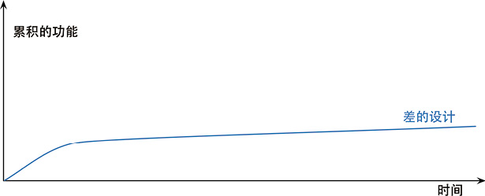
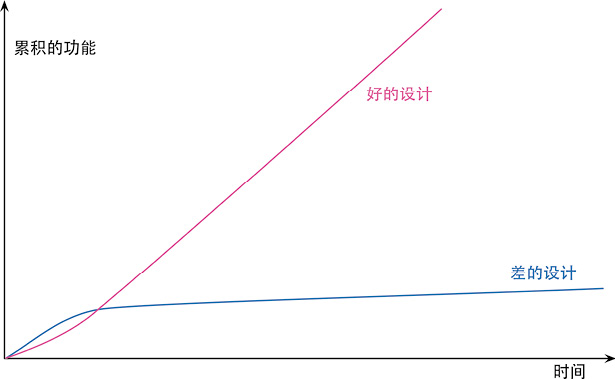

# 第 2 章 重构的原则

前一章所举的例子应该已经让你对重构有了一个良好的感觉。现在，我们应该回头看看重构的一些大原则。

## 2.1 何谓重构

一线的实践者们经常很随意地使用“重构”这个词——软件开发领域的很多词汇都有此待遇。我使用这个词的方式比较严谨，并且我发现这种严谨的方式很有好处。（下列定义与本书第 1 版中给出的定义一样。）“重构”这个词既可以用作名词也可以用作动词。名词形式的定义是：

重构（名词）：对软件内部结构的一种调整，目的是在不改变软件可观察行为的前提下，提高其可理解性，降低其修改成本。

这个定义适用于我在前面的例子中提到的那些有名字的重构，例如提炼函数（106）和以多态取代条件表达式（272）。

动词形式的定义是：

重构（动词）：使用一系列重构手法，在不改变软件可观察行为的前提下，调整其结构。

所以，我可能会花一两个小时进行重构（动词），其间我会使用几十个不同的重构（名词）。

过去十几年，这个行业里的很多人用“重构”这个词来指代任何形式的代码清理，但上面的定义所指的是一种特定的清理代码的方式。重构的关键在于运用大量微小且保持软件行为的步骤，一步步达成大规模的修改。每个单独的重构要么很小，要么由若干小步骤组合而成。因此，在重构的过程中，我的代码很少进入不可工作的状态，即便重构没有完成，我也可以在任何时刻停下来。

::: tip
如果有人说他们的代码在重构过程中有一两天时间不可用，基本上可以确定，他们在做的事不是重构。
:::

我会用“结构调整”（restructuring）来泛指对代码库进行的各种形式的重新组织或清理，重构则是特定的一类结构调整。刚接触重构的人看我用很多小步骤完成似乎可以一大步就能做完的事，可能会觉得这样很低效。但小步前进能让我走得更快，因为这些小步骤能完美地彼此组合，而且——更关键的是——整个过程中我不会花任何时间来调试。

在上述定义中，我用了“可观察行为”的说法。它的意思是，整体而言，经过重构之后的代码所做的事应该与重构之前大致一样。这个说法并非完全严格，并且我是故意保留这点儿空间的：重构之后的代码不一定与重构前行为完全一致。比如说，提炼函数（106）会改变函数调用栈，因此程序的性能就会有所改变；改变函数声明（124）和搬移函数（198）等重构经常会改变模块的接口。不过就用户应该关心的行为而言，不应该有任何改变。如果我在重构过程中发现了任何 bug，重构完成后同样的 bug 应该仍然存在（不过，如果潜在的 bug 还没有被任何人发现，也可以当即把它改掉）。

重构与性能优化有很多相似之处：两者都需要修改代码，并且两者都不会改变程序的整体功能。两者的差别在于其目的：重构是为了让代码“更容易理解，更易于修改”。这可能使程序运行得更快，也可能使程序运行得更慢。在性能优化时，我只关心让程序运行得更快，最终得到的代码有可能更难理解和维护，对此我有心理准备。

## 2.2 两顶帽子

Kent Beck 提出了“两顶帽子”的比喻。使用重构技术开发软件时，我把自己的时间分配给两种截然不同的行为：添加新功能和重构。添加新功能时，我不应该修改既有代码，只管添加新功能。通过添加测试并让测试正常运行，我可以衡量自己的工作进度。重构时我就不能再添加功能，只管调整代码的结构。此时我不应该添加任何测试（除非发现有先前遗漏的东西），只在绝对必要（用以处理接口变化）时才修改测试。

软件开发过程中，我可能会发现自己经常变换帽子。首先我会尝试添加新功能，然后会意识到：如果把程序结构改一下，功能的添加会容易得多。于是我换一顶帽子，做一会儿重构工作。程序结构调整好后，我又换上原先的帽子，继续添加新功能。新功能正常工作后，我又发现自己的编码造成程序难以理解，于是又换上重构帽子……整个过程或许只花 10 分钟，但无论何时我都清楚自己戴的是哪一顶帽子，并且明白不同的帽子对编程状态提出的不同要求。

## 2.3 为何重构

我不想把重构说成是包治百病的万灵丹，它绝对不是所谓的“银弹”。不过它的确很有价值，尽管它不是一颗“银弹”，却可以算是一把“银钳子”，可以帮你始终良好地控制自己的代码。重构是一个工具，它可以（并且应该）用于以下几个目的。

### 重构改进软件的设计

如果没有重构，程序的内部设计（或者叫架构）会逐渐腐败变质。当人们只为短期目的而修改代码时，他们经常没有完全理解架构的整体设计，于是代码逐渐失去了自己的结构。程序员越来越难通过阅读源码来理解原来的设计。代码结构的流失有累积效应。越难看出代码所代表的设计意图，就越难保护其设计，于是设计就腐败得越快。经常性的重构有助于代码维持自己该有的形态。

完成同样一件事，设计欠佳的程序往往需要更多代码，这常常是因为代码在不同的地方使用完全相同的语句做同样的事，因此改进设计的一个重要方向就是消除重复代码。代码量减少并不会使系统运行更快，因为这对程序的资源占用几乎没有任何明显影响。然而代码量减少将使未来可能的程序修改动作容易得多。代码越多，做正确的修改就越困难，因为有更多代码需要理解。我在这里做了点儿修改，系统却不如预期那样工作，因为我没有修改另一处——那里的代码做着几乎完全一样的事情，只是所处环境略有不同。消除重复代码，我就可以确定所有事物和行为在代码中只表述一次，这正是优秀设计的根本。

### 重构使软件更容易理解

所谓程序设计，很大程度上就是与计算机对话：我编写代码告诉计算机做什么事，而它的响应是按照我的指示精确行动。一言以蔽之，我所做的就是填补“我想要它做什么”和“我告诉它做什么”之间的缝隙。编程的核心就在于“准确说出我想要的”。然而别忘了，除了计算机外，源码还有其他读者：几个月之后可能会有另一位程序员尝试读懂我的代码并对其做一些修改。我们很容易忘记这这位读者，但他才是最重要的。计算机是否多花了几个时钟周期来编译，又有什么关系呢？如果一个程序员花费一周时间来修改某段代码，那才要命呢——如果他理解了我的代码，这个修改原本只需一小时。

问题在于，当我努力让程序运转的时候，我不会想到未来出现的那个开发者。是的，我们应该改变一下开发节奏，让代码变得更易于理解。重构可以帮我让代码更易读。开始进行重构前，代码可以正常运行，但结构不够理想。在重构上花一点点时间，就可以让代码更好地表达自己的意图——更清晰地说出我想要做的。

关于这一点，我没必要表现得多么无私。很多时候那个未来的开发者就是我自己。此时重构就显得尤其重要了。我是一个很懒惰的程序员，我的懒惰表现形式之一就是：总是记不住自己写过的代码。事实上，对于任何能够立刻查阅的东西，我都故意不去记它，因为我怕把自己的脑袋塞爆。我总是尽量把该记住的东西写进代码里，这样我就不必记住它了。这么一来，下班后我还可以喝上两杯 Maudite 啤酒，不必太担心它杀光我的脑细胞。

### 重构帮助找到 bug

对代码的理解，可以帮我找到 bug。我承认我不太擅长找 bug。有些人只要盯着一大段代码就可以找出里面的 bug，我不行。但我发现，如果对代码进行重构，我就可以深入理解代码的所作所为，并立即把新的理解反映在代码当中。搞清楚程序结构的同时，我也验证了自己所做的一些假设，于是想不把 bug 揪出来都难。

这让我想起了 Kent Beck 经常形容自己的一句话：“我不是一个特别好的程序员，我只是一个有着一些特别好的习惯的还不错的程序员。”重构能够帮助我更有效地写出健壮的代码。

### 重构提高编程速度

最后，前面的一切都归结到了这一点：重构帮我更快速地开发程序。

听起来有点儿违反直觉。当我谈到重构时，人们很容易看出它能够提高质量。改善设计、提升可读性、减少 bug，这些都能提高质量。但花在重构上的时间，难道不是在降低开发速度吗？

当我跟那些在一个系统上工作较长时间的软件开发者交谈时，经常会听到这样的故事：一开始他们进展很快，但如今想要添加一个新功能需要的时间就要长得多。他们需要花越来越多的时间去考虑如何把新功能塞进现有的代码库，不断蹦出来的 bug 修复起来也越来越慢。代码库看起来就像补丁摞补丁，需要细致的考古工作才能弄明白整个系统是如何工作的。这份负担不断拖慢新增功能的速度，到最后程序员恨不得从头开始重写整个系统。

下面这幅图可以描绘他们经历的困境。

但有些团队的境遇则截然不同。他们添加新功能的速度越来越快，因为他们能利用已有的功能，基于已有的功能快速构建新功能。

两种团队的区别就在于软件的内部质量。需要添加新功能时，内部质量良好的软件让我可以很容易找到在哪里修改、如何修改。良好的模块划分使我只需要理解代码库的一小部分，就可以做出修改。如果代码很清晰，我引入 bug 的可能性就会变小，即使引入了 bug，调试也会容易得多。理想情况下，我的代码库会逐步演化成一个平台，在其上可以很容易地构造与其领域相关的新功能。

我把这种现象称为“设计耐久性假说”：通过投入精力改善内部设计，我们增加了软件的耐久性，从而可以更长时间地保持开发的快速。我还无法科学地证明这个理论，所以我说它是一个“假说”。但我的经验，以及我在职业生涯中认识的上百名优秀程序员的经验，都支持这个假说。

20 年前，行业的陈规认为：良好的设计必须在开始编程之前完成，因为一旦开始编写代码，设计就只会逐渐腐败。重构改变了这个图景。现在我们可以改善已有代码的设计，因此我们可以先做一个设计，然后不断改善它，哪怕程序本身的功能也在不断发生着变化。由于预先做出良好的设计非常困难，想要既体面又快速地开发功能，重构必不可少。

## 2.4 何时重构

在我编程的每个小时，我都会做重构。有几种方式可以把重构融入我的工作过程里。

::: tip
三次法则

Don Roberts 给了我一条准则：第一次做某件事时只管去做；第二次做类似的事会产生反感，但无论如何还是可以去做；第三次再做类似的事，你就应该重构。

正如老话说的：事不过三，三则重构。
:::

### 预备性重构：让添加新功能更容易

重构的最佳时机就在添加新功能之前。在动手添加新功能之前，我会看看现有的代码库，此时经常会发现：如果对代码结构做一点微调，我的工作会容易得多。也许已经有个函数提供了我需要的大部分功能，但有几个字面量的值与我的需要略有冲突。如果不做重构，我可能会把整个函数复制过来，修改这几个值，但这就会导致重复代码——如果将来我需要做修改，就必须同时修改两处（更麻烦的是，我得先找到这两处）。而且，如果将来我还需要一个类似又略有不同的功能，就只能再复制粘贴一次，这可不是个好主意。所以我戴上重构的帽子，使用函数参数化（310）。做完这件事以后，接下来我就只需要调用这个函数，传入我需要的参数。

::: tip
这就好像我要往东去 100 公里。我不会往东一头把车开进树林，而是先往北开 20 公里上高速，然后再向东开 100 公里。后者的速度比前者要快上 3 倍。如果有人催着你“赶快直接去那儿”，有时你需要说：“等等，我要先看看地图，找出最快的路径。”这就是预备性重构于我的意义。

——Jessica Kerr
:::

修复 bug 时的情况也是一样。在寻找问题根因时，我可能会发现：如果把 3 段一模一样且都会导致错误的代码合并到一处，问题修复起来会容易得多。或者，如果把某些更新数据的逻辑与查询逻辑分开，会更容易避免造成错误的逻辑纠缠。用重构改善这些情况，在同样场合再次出现同样 bug 的概率也会降低。

### 帮助理解的重构：使代码更易懂

我需要先理解代码在做什么，然后才能着手修改。这段代码可能是我写的，也可能是别人写的。一旦我需要思考“这段代码到底在做什么”，我就会自问：能不能重构这段代码，令其一目了然？我可能看见了一段结构糟糕的条件逻辑，也可能希望复用一个函数，但花费了几分钟才弄懂它到底在做什么，因为它的函数命名实在是太糟糕了。这些都是重构的机会。

看代码时，我会在脑海里形成一些理解，但我的记性不好，记不住那么多细节。正如 Ward Cunningham 所说，通过重构，我就把脑子里的理解转移到了代码本身。随后我运行这个软件，看它是否正常工作，来检查这些理解是否正确。如果把对代码的理解植入代码中，这份知识会保存得更久，并且我的同事也能看到。

重构带来的帮助不仅发生在将来——常常是立竿见影。我会先在一些小细节上使用重构来帮助理解，给一两个变量改名，让它们更清楚地表达意图，以方便理解，或是将一个长函数拆成几个小函数。当代码变得更清晰一些时，我就会看见之前看不见的设计问题。如果不做前面的重构，我可能永远都看不见这些设计问题，因为我不够聪明，无法在脑海中推演所有这些变化。Ralph Johnson 说，这些初步的重构就像扫去窗上的尘埃，使我们得以看到窗外的风景。在研读代码时，重构会引领我获得更高层面的理解，如果只是阅读代码很难有此领悟。有些人以为这些重构只是毫无意义地把玩代码，他们没有意识到，缺少了这些细微的整理，他们就无法看到隐藏在一片混乱背后的机遇。

### 捡垃圾式重构

帮助理解的重构还有一个变体：我已经理解代码在做什么，但发现它做得不好，例如逻辑不必要地迂回复杂，或者两个函数几乎完全相同，可以用一个参数化的函数取而代之。这里有一个取舍：我不想从眼下正要完成的任务上跑题太多，但我也不想把垃圾留在原地，给将来的修改增加麻烦。如果我发现的垃圾很容易重构，我会马上重构它；如果重构需要花一些精力，我可能会拿一张便笺纸把它记下来，完成当下的任务再回来重构它。

当然，有时这样的垃圾需要好几个小时才能解决，而我又有更紧急的事要完成。不过即便如此，稍微花一点工夫做一点儿清理，通常都是值得的。正如野营者的老话所说：至少要让营地比你到达时更干净。如果每次经过这段代码时都把它变好一点点，积少成多，垃圾总会被处理干净。重构的妙处就在于，每个小步骤都不会破坏代码——所以，有时一块垃圾在好几个月之后才终于清理干净，但即便每次清理并不完整，代码也不会被破坏。

### 有计划的重构和见机行事的重构

上面的例子——预备性重构、帮助理解的重构、捡垃圾式重构——都是见机行事的：我并不专门安排一段时间来重构，而是在添加功能或修复 bug 的同时顺便重构。这是我自然的编程流的一部分。不管是要添加功能还是修复 bug，重构对我当下的任务有帮助，而且让我未来的工作更轻松。这是一件很重要而又常被误解的事：重构不是与编程割裂的行为。你不会专门安排时间重构，正如你不会专门安排时间写 if 语句。我的项目计划上没有专门留给重构的时间，绝大多数重构都在我做其他事的过程中自然发生。

::: tip
肮脏的代码必须重构，但漂亮的代码也需要很多重构。
:::

还有一种常见的误解认为，重构就是人们弥补过去的错误或者清理肮脏的代码。当然，如果遇上了肮脏的代码，你必须重构，但漂亮的代码也需要很多重构。在写代码时，我会做出很多权衡取舍：参数化需要做到什么程度？函数之间的边界应该划在哪里？对于昨天的功能完全合理的权衡，在今天要添加新功能时可能就不再合理。好在，当我需要改变这些权衡以反映现实情况的变化时，整洁的代码重构起来会更容易。

::: tip
每次要修改时，首先令修改很容易（警告：这件事有时会很难），然后再进行这次容易的修改。

——Kent Beck
:::

长久以来，人们认为编写软件是一个累加的过程：要添加新功能，我们就应该增加新代码。但优秀的程序员知道，添加新功能最快的方法往往是先修改现有的代码，使新功能容易被加入。所以，软件永远不应该被视为“完成”。每当需要新能力时，软件就应该做出相应的改变。越是在已有代码中，这样的改变就越显重要。

不过，说了这么多，并不表示有计划的重构总是错的。如果团队过去忽视了重构，那么常常会需要专门花一些时间来优化代码库，以便更容易添加新功能。在重构上花一个星期的时间，会在未来几个月里发挥价值。有时，即便团队做了日常的重构，还是会有问题在某个区域逐渐累积长大，最终需要专门花些时间来解决。但这种有计划的重构应该很少，大部分重构应该是不起眼的、见机行事的。

我听过的一条建议是：将重构与添加新功能在版本控制的提交中分开。这样做的一大好处是可以各自独立地审阅和批准这些提交。但我并不认同这种做法。重构常常与新添功能紧密交织，不值得花工夫把它们分开。并且这样做也使重构脱离了上下文，使人看不出这些“重构提交”的价值。每个团队应该尝试并找出适合自己的工作方式，只是要记住：分离重构提交并不是毋庸置疑的原则，只有当你真的感到有益时，才值得这样做。

### 长期重构

大多数重构可以在几分钟——最多几小时——内完成。但有一些大型的重构可能要花上几个星期，例如要替换一个正在使用的库，或者将整块代码抽取到一个组件中并共享给另一支团队使用，再或者要处理一大堆混乱的依赖关系，等等。

即便在这样的情况下，我仍然不愿让一支团队专门做重构。可以让整个团队达成共识，在未来几周时间里逐步解决这个问题，这经常是一个有效的策略。每当有人靠近“重构区”的代码，就把它朝想要改进的方向推动一点。这个策略的好处在于，重构不会破坏代码——每次小改动之后，整个系统仍然照常工作。例如，如果想替换掉一个正在使用的库，可以先引入一层新的抽象，使其兼容新旧两个库的接口。一旦调用方已经完全改为使用这层抽象，替换下面的库就会容易得多。（这个策略叫作 Branch By Abstraction[mf-bba]。）

### 复审代码时重构

一些公司会做常规的代码复审（code review），因为这种活动可以改善开发状况。代码复审有助于在开发团队中传播知识，也有助于让较有经验的开发者把知识传递给比较欠缺经验的人，并帮助更多人理解大型软件系统中的更多部分。代码复审对于编写清晰代码也很重要。我的代码也许对我自己来说很清晰，对他人则不然。这是无法避免的，因为要让开发者设身处地为那些不熟悉自己所作所为的人着想，实在太困难了。代码复审也让更多人有机会提出有用的建议，毕竟我在一个星期之内能够想出的好点子很有限。如果能得到别人的帮助，我的生活会滋润得多，所以我总是期待更多复审。

我发现，重构可以帮助我复审别人的代码。开始重构前我可以先阅读代码，得到一定程度的理解，并提出一些建议。一旦想到一些点子，我就会考虑是否可以通过重构立即轻松地实现它们。如果可以，我就会动手。这样做了几次以后，我可以更清楚地看到，当我的建议被实施以后，代码会是什么样。我不必想象代码应该是什么样，我可以真实看见。于是我可以获得更高层次的认识。如果不进行重构，我永远无法得到这样的认识。

重构还可以帮助代码复审工作得到更具体的结果。不仅获得建议，而且其中许多建议能够立刻实现。最终你将从实践中得到比以往多得多的成就感。

至于如何在代码复审的过程中加入重构，这要取决于复审的形式。在常见的 pull request 模式下，复审者独自浏览代码，代码的作者不在旁边，此时进行重构效果并不好。如果代码的原作者在旁边会好很多，因为作者能提供关于代码的上下文信息，并且充分认同复审者进行修改的意图。对我个人而言，与原作者肩并肩坐在一起，一边浏览代码一边重构，体验是最佳的。这种工作方式很自然地导向结对编程：在编程的过程中持续不断地进行代码复审。

### 怎么对经理说

“该怎么跟经理说重构的事?”这是我最常被问到的一个问题。毋庸讳言，我见过一些场合，“重构”被视为一个脏词——经理（和客户）认为重构要么是在弥补过去犯下的错误，要么是不增加价值的无用功。如果团队又计划了几周时间专门做重构，情况就更糟糕了——如果他们做的其实还不是重构，而是不加小心的结构调整，然后又对代码库造成了破坏，那可就真是糟透了。

如果这位经理懂技术，能理解“设计耐久性假说”，那么向他说明重构的意义应该不会很困难。这样的经理应该会鼓励日常的重构，并主动寻找团队日常重构做得不够的征兆。虽然“团队做了太多重构”的情况确实也发生过，但比起做得不够的情况要罕见得多了。

当然，很多经理和客户不具备这样的技术意识，他们不理解代码库的健康对生产率的影响。这种情况下我会给团队一个较有争议的建议：不要告诉经理！

这是在搞破坏吗？我不这样想。软件开发者都是专业人士。我们的工作就是尽可能快速创造出高效软件。我的经验告诉我，对于快速创造软件，重构可带来巨大帮助。如果需要添加新功能，而原本设计却又使我无法方便地修改，我发现先重构再添加新功能会更快些。如果要修补错误，就得先理解软件的工作方式，而我发现重构是理解软件的最快方式。受进度驱动的经理要我尽可能快速完成任务，至于怎么完成，那就是我的事了。我领这份工资，是因为我擅长快速实现新功能；我认为最快的方式就是重构，所以我就重构。

### 何时不应该重构

听起来好像我一直在提倡重构，但确实有一些不值得重构的情况。

如果我看见一块凌乱的代码，但并不需要修改它，那么我就不需要重构它。如果丑陋的代码能被隐藏在一个 API 之下，我就可以容忍它继续保持丑陋。只有当我需要理解其工作原理时，对其进行重构才有价值。

另一种情况是，如果重写比重构还容易，就别重构了。这是个困难的决定。如果不花一点儿时间尝试，往往很难真实了解重构一块代码的难度。决定到底应该重构还是重写，需要良好的判断力与丰富的经验，我无法给出一条简单的建议。

## 2.5 重构的挑战

每当有人大力推荐一种技术、工具或者架构时，我总是会观察这东西会遇到哪些挑战，毕竟生活中很少有晴空万里的好事。你需要了解一件事背后的权衡取舍，才能决定何时何地应用它。我认为重构是一种很有价值的技术，大多数团队都应该更多地重构，但它也不是完全没有挑战的。有必要充分了解重构会遇到的挑战，这样才能做出有效应对。

### 延缓新功能开发

如果你读了前面一小节，我对这个挑战的回应便已经很清楚了。尽管重构的目的是加快开发速度，但是，仍旧很多人认为，花在重构的时间是在拖慢新功能的开发进度。“重构会拖慢进度”这种看法仍然很普遍，这可能是导致人们没有充分重构的最大阻力所在。

::: tip
重构的唯一目的就是让我们开发更快，用更少的工作量创造更大的价值。
:::

有一种情况确实需要权衡取舍。我有时会看到一个（大规模的）重构很有必要进行，而马上要添加的功能非常小，这时我会更愿意先把新功能加上，然后再做这次大规模重构。做这个决定需要判断力——这是我作为程序员的专业能力之一。我很难描述决定的过程，更无法量化决定的依据。

我清楚地知道，预备性重构常会使修改更容易，所以如果做一点儿重构能让新功能实现更容易，我一定会做。如果一个问题我已经见过，此时我也会更倾向于重构它——有时我就得先看见一块丑陋的代码几次，然后才能提起劲头来重构它。也就是说，如果一块代码我很少触碰，它不会经常给我带来麻烦，那么我就倾向于不去重构它。如果我还没想清楚究竟应该如何优化代码，那么我可能会延迟重构；当然，有的时候，即便没想清楚优化的方向，我也会先做些实验，试试看能否有所改进。

我从同事那里听到的证据表明，在我们这个行业里，重构不足的情况远多于重构过度的情况。换句话说，绝大多数人应该尝试多做重构。代码库的健康与否，到底会对生产率造成多大的影响，很多人可能说不出来，因为他们没有太多在健康的代码库上工作的经历——轻松地把现有代码组合配置，快速构造出复杂的新功能，这种强大的开发方式他们没有体验过。

虽然我们经常批评管理者以“保障开发速度”的名义压制重构，其实程序员自己也经常这么干。有时他们自己觉得不应该重构，其实他们的领导还挺希望他们做一些重构的。如果你是一支团队的技术领导，一定要向团队成员表明，你重视改善代码库健康的价值。合理判断何时应该重构、何时应该暂时不重构，这样的判断力需要多年经验积累。对于重构缺乏经验的年轻人需要有意的指导，才能帮助他们加速经验积累的过程。

有些人试图用“整洁的代码”“良好的工程实践”之类道德理由来论证重构的必要性，我认为这是个陷阱。重构的意义不在于把代码库打磨得闪闪发光，而是纯粹经济角度出发的考量。我们之所以重构，因为它能让我们更快——添加功能更快，修复 bug 更快。一定要随时记住这一点，与别人交流时也要不断强调这一点。重构应该总是由经济利益驱动。程序员、经理和客户越理解这一点，“好的设计”那条曲线就会越经常出现。

### 代码所有权

很多重构手法不仅会影响一个模块内部，还会影响该模块与系统其他部分的关系。比如我想给一个函数改名，并且我也能找到该函数的所有调用者，那么我只需运用改变函数声明（124），在一次重构中修改函数声明和调用者。但即便这么简单的一个重构，有时也无法实施：调用方代码可能由另一支团队拥有，而我没有权限写入他们的代码库；这个函数可能是一个提供给客户的 API，这时我根本无法知道是否有人使用它，至于谁在用、用得有多频繁就更是一无所知。这样的函数属于已发布接口（published interface）：接口的使用者（客户端）与声明者彼此独立，声明者无权修改使用者的代码。

代码所有权的边界会妨碍重构，因为一旦我自作主张地修改，就一定会破坏使用者的程序。这不会完全阻止重构，我仍然可以做很多重构，但确实会对重构造成约束。为了给一个函数改名，我需要使用函数改名（124），但同时也得保留原来的函数声明，使其把调用传递给新的函数。这会让接口变复杂，但这就是为了避免破坏使用者的系统而不得不付出的代价。我可以把旧的接口标记为“不推荐使用”（deprecated），等一段时间之后最终让其退休；但有些时候，旧的接口必须一直保留下去。

由于这些复杂性，我建议不要搞细粒度的强代码所有制。有些组织喜欢给每段代码都指定唯一的所有者，只有这个人能修改这段代码。我曾经见过一支只有三个人的团队以这种方式运作，每个程序员都要给另外两人发布接口，随之而来的就是接口维护的种种麻烦。如果这三个人都直接去代码库里做修改，事情会简单得多。我推荐团队代码所有制，这样一支团队里的成员都可以修改这个团队拥有的代码，即便最初写代码的是别人。程序员可能各自分工负责系统的不同区域，但这种责任应该体现为监控自己责任区内发生的修改，而不是简单粗暴地禁止别人修改。

这种较为宽容的代码所有制甚至可以应用于跨团队的场合。有些团队鼓励类似于开源的模型：B 团队的成员也可以在一个分支上修改 A 团队的代码，然后把提交发送给 A 团队去审核。这样一来，如果团队想修改自己的函数，他们就可以同时修改该函数的客户端的代码；只要客户端接受了他们的修改，就可以删掉旧的函数声明了。对于涉及多个团队的大系统开发，在“强代码所有制”和“混乱修改”两个极端之间，这种类似开源的模式常常是一个合适的折中。

### 分支

很多团队采用这样的版本控制实践：每个团队成员各自在代码库的一条分支上工作，进行相当大量的开发之后，才把各自的修改合并回主线分支（这条分支通常叫 master 或 trunk），从而与整个团队分享。常见的做法是在分支上开发完整的功能，直到功能可以发布到生产环境，才把该分支合并回主线。这种做法的拥趸声称，这样能保持主线不受尚未完成的代码侵扰，能保留清晰的功能添加的版本记录，并且在某个功能出问题时能容易地撤销修改。

这样的特性分支有其缺点。在隔离的分支上工作得越久，将完成的工作集成（integrate）回主线就会越困难。为了减轻集成的痛苦，大多数人的办法是频繁地从主线合并（merge）或者变基（rebase）到分支。但如果有几个人同时在各自的特性分支上工作，这个办法并不能真正解决问题，因为合并与集成是两回事。如果我从主线合并到我的分支，这只是一个单向的代码移动——我的分支发生了修改，但主线并没有。而“集成”是一个双向的过程：不仅要把主线的修改拉（pull）到我的分支上，而且要把我这里修改的结果推（push）回到主线上，两边都会发生修改。假如另一名程序员 Rachel 正在她的分支上开发，我是看不见她的修改的，直到她将自己的修改与主线集成；此时我就必须把她的修改合并到我的特性分支，这可能需要相当的工作量。其中困难的部分是处理语义变化。现代版本控制系统都能很好地合并程序文本的复杂修改，但对于代码的语义它们一无所知。如果我修改了一个函数的名字，版本控制工具可以很轻松地将我的修改与 Rachel 的代码集成。但如果在集成之前，她在自己的分支里新添调用了这个被我改名的函数，集成之后的代码就会被破坏。

分支合并本来就是一个复杂的问题，随着特性分支存在的时间加长，合并的难度会指数上升。集成一个已经存在了 4 个星期的分支，较之集成存在了 2 个星期的分支，难度可不止翻倍。所以很多人认为，应该尽量缩短特性分支的生存周期，比如只有一两天。还有一些人（比如我本人）认为特性分支的生命还应该更短，我们采用的方法叫作持续集成（Continuous Integration，CI），也叫“基于主干开发”（Trunk-Based Development）。在使用 CI 时，每个团队成员每天至少向主线集成一次。这个实践避免了任何分支彼此差异太大，从而极大地降低了合并的难度。不过 CI 也有其代价：你必须使用相关的实践以确保主线随时处于健康状态，必须学会将大功能拆分成小块，还必须使用特性开关（feature toggle，也叫特性旗标，feature flag）将尚未完成又无法拆小的功能隐藏掉。

CI 的粉丝之所以喜欢这种工作方式，部分原因是它降低了分支合并的难度，不过最重要的原因还是 CI 与重构能良好配合。重构经常需要对代码库中的很多地方做很小的修改（例如给一个广泛使用的函数改名），这样的修改尤其容易造成合并时的语义冲突。采用特性分支的团队常会发现重构加剧了分支合并的困难，并因此放弃了重构，这种情况我们曾经见过多次。CI 和重构能够良好配合，所以 Kent Beck 在极限编程中同时包含了这两个实践。

我并不是在说绝不应该使用特性分支。如果特性分支存在的时间足够短，它们就不会造成大问题。（实际上，使用 CI 的团队往往同时也使用分支，但他们会每天将分支与主线合并。）对于开源项目，特性分支可能是合适的做法，因为不时会有你不熟悉（因此也不信任）的程序员偶尔提交修改。但对全职的开发团队而言，特性分支对重构的阻碍太严重了。即便你没有完全采用 CI，我也一定会催促你尽可能频繁地集成。而且，用上 CI 的团队在软件交付上更加高效，我真心希望你认真考虑这个客观事实[Forsgren et al]。

### 测试

不会改变程序可观察的行为，这是重构的一个重要特征。如果仔细遵循重构手法的每个步骤，我应该不会破坏任何东西，但万一我犯了个错误怎么办？（呃，就我这个粗心大意的性格来说，请去掉“万一”两字。）人总会有出错的时候，不过只要及时发现，就不会造成大问题。既然每个重构都是很小的修改，即便真的造成了破坏，我也只需要检查最后一步的小修改——就算找不到出错的原因，只要回滚到版本控制中最后一个可用的版本就行了。

这里的关键就在于“快速发现错误”。要做到这一点，我的代码应该有一套完备的测试套件，并且运行速度要快，否则我会不愿意频繁运行它。也就是说，绝大多数情况下，如果想要重构，我得先有可以自测试的代码[mf-stc]。

有些读者可能会觉得，“自测试的代码”这个要求太高，根本无法实现。但在过去 20 年中，我看到很多团队以这种方式构造软件。的确，团队必须投入时间与精力在测试上，但收益是绝对划算的。自测试的代码不仅使重构成为可能，而且使添加新功能更加安全，因为我可以很快发现并干掉新近引入的 bug。这里的关键在于，一旦测试失败，我只需要查看上次测试成功运行之后修改的这部分代码；如果测试运行得很频繁，这个查看的范围就只有几行代码。知道必定是这几行代码造成 bug 的话，排查起来会容易得多。

这也回答了“重构风险太大，可能引入 bug”的担忧。如果没有自测试的代码，这种担忧就是完全合理的，这也是为什么我如此重视可靠的测试。

缺乏测试的问题可以用另一种方式来解决。如果我的开发环境很好地支持自动化重构，我就可以信任这些重构，不必运行测试。这时即便没有完备的测试套件，我仍然可以重构，前提是仅仅使用那些自动化的、一定安全的重构手法。这会让我损失很多好用的重构手法，不过剩下可用的也不少，我还是能从中获益。当然，我还是更愿意有自测试的代码，但如果没有，自动化重构的工具包也很好。

缺乏测试的现状还催生了另一种重构的流派：只使用一组经过验证是安全的重构手法。这个流派要求严格遵循重构的每个步骤，并且可用的重构手法是特定于语言的。使用这种方法，团队得以在测试覆盖率很低的大型代码库上开展一些有用的重构。这个重构流派比较新，涉及一些很具体、特定于编程语言的技巧与做法，行业里对这种方法的介绍和了解都还不足，因此本书不对其多做介绍。（不过我希望未来在我自己的网站上多讨论这个主题。感兴趣的读者可以查看 Jay Bazuzi 关于如何在 C++中安全地运用提炼函数（106）的描述[Bazuzi]，借此获得一点儿对这个重构流派的了解。）

毫不意外，自测试代码与持续集成紧密相关——我们仰赖持续集成来及时捕获分支集成时的语义冲突。自测试代码是极限编程的另一个重要组成部分，也是持续交付的关键环节。

### 遗留代码

大多数人会觉得，有一大笔遗产是件好事，但从程序员的角度来看就不同了。遗留代码往往很复杂，测试又不足，而且最关键的是，是别人写的（瑟瑟发抖）。

重构可以很好地帮助我们理解遗留系统。引人误解的函数名可以改名，使其更好地反映代码用途；糟糕的程序结构可以慢慢理顺，把程序从一块顽石打磨成美玉。整个故事都很棒，但我们绕不开关底的恶龙：遗留系统多半没测试。如果你面对一个庞大而又缺乏测试的遗留系统，很难安全地重构清理它。

对于这个问题，显而易见的答案是“没测试就加测试”。这事听起来简单（当然工作量必定很大），操作起来可没那么容易。一般来说，只有在设计系统时就考虑到了测试，这样的系统才容易添加测试——可要是如此，系统早该有测试了，我也不用操这份心了。

这个问题没有简单的解决办法，我能给出的最好建议就是买一本《修改代码的艺术》[Feathers]，照书里的指导来做。别担心那本书太老，尽管已经出版十多年，其中的建议仍然管用。一言以蔽之，它建议你先找到程序的接缝，在接缝处插入测试，如此将系统置于测试覆盖之下。你需要运用重构手法创造出接缝——这样的重构很危险，因为没有测试覆盖，但这是为了取得进展必要的风险。在这种情况下，安全的自动化重构简直就是天赐福音。如果这一切听起来很困难，因为它确实很困难。很遗憾，一旦跌进这个深坑，没有爬出来的捷径，这也是我强烈倡导从一开始就写能自测试的代码的原因。

就算有了测试，我也不建议你尝试一鼓作气把复杂而混乱的遗留代码重构成漂亮的代码。我更愿意随时重构相关的代码：每次触碰一块代码时，我会尝试把它变好一点点——至少要让营地比我到达时更干净。如果是一个大系统，越是频繁使用的代码，改善其可理解性的努力就能得到越丰厚的回报。

### 数据库

在本书的第 1 版中，我说过数据库是“重构经常出问题的一个领域”。然而在第 1 版问世之后仅仅一年，情况就发生了改变：我的同事 Pramod Sadalage 发展出一套渐进式数据库设计[mf-evodb]和数据库重构[Ambler &amp; Sadalage]的办法，如今已经被广泛使用。这项技术的精要在于：借助数据迁移脚本，将数据库结构的修改与代码相结合，使大规模的、涉及数据库的修改可以比较容易地开展。

假设我们要对一个数据库字段（列）改名。和改变函数声明（124）一样，我要找出结构的声明处和所有调用处，然后一次完成所有修改。但这里的复杂之处在于，原来基于旧字段的数据，也要转为使用新字段。我会写一小段代码来执行数据转化的逻辑，并把这段代码放进版本控制，跟数据结构声明与使用代码的修改一并提交。此后如果我想把数据库迁移到某个版本，只要执行当前数据库版本与目标版本之间的所有迁移脚本即可。

跟通常的重构一样，数据库重构的关键也是小步修改并且每次修改都应该完整，这样每次迁移之后系统仍然能运行。由于每次迁移涉及的修改都很小，写起来应该容易；将多个迁移串联起来，就能对数据库结构及其中存储的数据做很大的调整。

与常规的重构不同，很多时候，数据库重构最好是分散到多次生产发布来完成，这样即便某次修改在生产数据库上造成了问题，也比较容易回滚。比如，要改名一个字段，我的第一次提交会新添一个字段，但暂时不使用它。然后我会修改数据写入的逻辑，使其同时写入新旧两个字段。随后我就可以修改读取数据的地方，将它们逐个改为使用新字段。这步修改完成之后，我会暂停一小段时间，看看是否有 bug 冒出来。确定没有 bug 之后，我再删除已经没人使用的旧字段。这种修改数据库的方式是并行修改（Parallel Change，也叫扩展协议/expand-contract）[mf-pc]的一个实例。

## 2.6 重构、架构和 YAGNI

重构极大地改变了人们考虑软件架构的方式。在我的职业生涯早期，我被告知：在任何人开始写代码之前，必须先完成软件的设计和架构。一旦代码写出来，架构就固定了，只会因为程序员的草率对待而逐渐腐败。

重构改变了这种观点。有了重构技术，即便是已经在生产环境中运行了多年的软件，我们也有能力大幅度修改其架构。正如本书的副标题所指出的，重构可以改善既有代码的设计。但我在前面也提到了，修改遗留代码经常很有挑战，尤其当遗留代码缺乏恰当的测试时。

重构对架构最大的影响在于，通过重构，我们能得到一个设计良好的代码库，使其能够优雅地应对不断变化的需求。“在编码之前先完成架构”这种做法最大的问题在于，它假设了软件的需求可以预先充分理解。但经验显示，这个假设很多时候甚至可以说大多数时候是不切实际的。只有真正使用了软件、看到了软件对工作的影响，人们才会想明白自己到底需要什么，这样的例子不胜枚举。

应对未来变化的办法之一，就是在软件里植入灵活性机制。在编写一个函数时，我会考虑它是否有更通用的用途。为了应对我预期的应用场景，我预测可以给这个函数加上十多个参数。这些参数就是灵活性机制——跟大多数“机制”一样，它不是免费午餐。把所有这些参数都加上的话，函数在当前的使用场景下就会非常复杂。另外，如果我少考虑了一个参数，已经加上的这一堆参数会使新添参数更麻烦。而且我经常会把灵活性机制弄错——可能是未来的需求变更并非以我期望的方式发生，也可能我对机制的设计不好。考虑到所有这些因素，很多时候这些灵活性机制反而拖慢了我响应变化的速度。

有了重构技术，我就可以采取不同的策略。与其猜测未来需要哪些灵活性、需要什么机制来提供灵活性，我更愿意只根据当前的需求来构造软件，同时把软件的设计质量做得很高。随着对用户需求的理解加深，我会对架构进行重构，使其能够应对新的需要。如果一种灵活性机制不会增加复杂度（比如添加几个命名良好的小函数），我可以很开心地引入它；但如果一种灵活性会增加软件复杂度，就必须先证明自己值得被引入。如果不同的调用者不会传入不同的参数值，那么就不要添加这个参数。当真的需要添加这个参数时，运用函数参数化（310）也很容易。要判断是否应该为未来的变化添加灵活性，我会评估“如果以后再重构有多困难”，只有当未来重构会很困难时，我才考虑现在就添加灵活性机制。我发现这是一个很有用的决策方法。

这种设计方法有很多名字：简单设计、增量式设计或者 YAGNI[mf-yagni]——“你不会需要它”（you arenʼt going to need it）的缩写。YAGNI 并不是“不做架构性思考”的意思，不过确实有人以这种欠考虑的方式做事。我把 YAGNI 视为将架构、设计与开发过程融合的一种工作方式，这种工作方式必须有重构作为基础才可靠。

采用 YAGNI 并不表示完全不用预先考虑架构。总有一些时候，如果缺少预先的思考，重构会难以开展。但两者之间的平衡点已经发生了很大的改变：如今我更倾向于等一等，待到对问题理解更充分，再来着手解决。演进式架构[Ford et al.]是一门仍在不断发展的学科，架构师们在不断探索有用的模式和实践，充分发挥迭代式架构决策的能力。

## 2.7 重构与软件开发过程

读完前面“重构的挑战”一节，你大概已经有这个印象：重构是否有效，与团队采用的其他软件开发实践紧密相关。重构起初是作为极限编程（XP）[mf-xp]的一部分被人们采用的，XP 本身就融合了一组不太常见而又彼此关联的实践，例如持续集成、自测试代码以及重构（后两者融汇成了测试驱动开发）。

极限编程是最早的敏捷软件开发方法[mf-nm]之一。在一段历史时期，极限编程引领了敏捷的崛起。如今已经有很多项目使用敏捷方法，甚至敏捷的思维已经被视为主流，但实际上大部分“敏捷”项目只是徒有其名。要真正以敏捷的方式运作项目，团队成员必须在重构上有能力、有热情，他们采用的开发过程必须与常规的、持续的重构相匹配。

重构的第一块基石是自测试代码。我应该有一套自动化的测试，我可以频繁地运行它们，并且我有信心：如果我在编程过程中犯了任何错误，会有测试失败。这块基石如此重要，我会专门用一章篇幅来讨论它。

如果一支团队想要重构，那么每个团队成员都需要掌握重构技能，能在需要时开展重构，而不会干扰其他人的工作。这也是我鼓励持续集成的原因：有了 CI，每个成员的重构都能快速分享给其他同事，不会发生这边在调用一个接口那边却已把这个接口删掉的情况；如果一次重构会影响别人的工作，我们很快就会知道。自测试的代码也是持续集成的关键环节，所以这三大实践——自测试代码、持续集成、重构——彼此之间有着很强的协同效应。

有这三大实践在手，我们就能运用前一节介绍的 YAGNI 设计方法。重构和 YAGNI 交相呼应、彼此增效，重构（及其前置实践）是 YAGNI 的基础，YAGNI 又让重构更易于开展：比起一个塞满了想当然的灵活性的系统，当然是修改一个简单的系统要容易得多。在这些实践之间找到合适的平衡点，你就能进入良性循环，你的代码既牢固可靠又能快速响应变化的需求。

有这三大核心实践打下的基础，才谈得上运用敏捷思想的其他部分。持续交付确保软件始终处于可发布的状态，很多互联网团队能做到一天多次发布，靠的正是持续交付的威力。即便我们不需要如此频繁的发布，持续集成也能帮我们降低风险，并使我们做到根据业务需要随时安排发布，而不受技术的局限。有了可靠的技术根基，我们能够极大地压缩“从好点子到生产代码”的周期时间，从而更好地服务客户。这些技术实践也会增加软件的可靠性，减少耗费在 bug 上的时间。

这一切说起来似乎很简单，但实际做起来毫不容易。不管采用什么方法，软件开发都是一件复杂而微妙的事，涉及人与人之间、人与机器之间的复杂交互。我在这里描述的方法已经被证明可以应对这些复杂性，但——就跟其他所有方法一样——对使用者的实践和技能有要求。

## 2.8 重构与性能

关于重构，有一个常被提出的问题：它对程序的性能将造成怎样的影响？为了让软件易于理解，我常会做出一些使程序运行变慢的修改。这是一个重要的问题。我并不赞成为了提高设计的纯洁性而忽视性能，把希望寄托于更快的硬件身上也绝非正道。已经有很多软件因为速度太慢而被用户拒绝，日益提高的机器速度也只不过略微放宽了速度方面的限制而已。但是，换个角度说，虽然重构可能使软件运行更慢，但它也使软件的性能优化更容易。除了对性能有严格要求的实时系统，其他任何情况下“编写快速软件”的秘密就是：先写出可调优的软件，然后调优它以求获得足够的速度。

我看过 3 种编写快速软件的方法。其中最严格的是时间预算法，这通常只用于性能要求极高的实时系统。如果使用这种方法，分解你的设计时就要做好预算，给每个组件预先分配一定资源，包括时间和空间占用。每个组件绝对不能超出自己的预算，就算拥有组件之间调度预配时间的机制也不行。这种方法高度重视性能，对于心律调节器一类的系统是必需的，因为在这样的系统中迟来的数据就是错误的数据。但对其他系统（例如我经常开发的企业信息系统）而言，如此追求高性能就有点儿过分了。

第二种方法是持续关注法。这种方法要求任何程序员在任何时间做任何事时，都要设法保持系统的高性能。这种方式很常见，感觉上很有吸引力，但通常不会起太大作用。任何修改如果是为了提高性能，通常会使程序难以维护，继而减缓开发速度。如果最终得到的软件的确更快了，那么这点损失尚有所值，可惜通常事与愿违，因为性能改善一旦被分散到程序各个角落，每次改善都只不过是从对程序行为的一个狭隘视角出发而已，而且常常伴随着对编译器、运行时环境和硬件行为的误解。

::: tip
劳而无获

克莱斯勒综合薪资系统的支付过程太慢了。虽然我们的开发还没结束，这个问题却已经开始困扰我们，因为它已经拖累了测试速度。

Kent Beck、Martin Fowler 和我决定解决这个问题。等待大伙儿会合的时间里，凭着对这个系统的全盘了解，我开始推测：到底是什么让系统变慢了？我想到数种可能，然后和伙伴们谈了几种可能的修改方案。最后，我们就“如何让这个系统运行更快”，提出了一些真正的好点子。

然后，我们拿 Kent 的工具度量了系统性能。我一开始所想的可能性竟然全都不是问题肇因。我们发现：系统把一半时间用来创建“日期”实例（instance）。更有趣的是，所有这些实例都有相同的几个值。

于是我们观察日期对象的创建逻辑，发现有机会将它优化。这些日期对象在创建时都经过了一个字符串转换过程，然而这里并没有任何外部数据输入。之所以使用字符串转换方式，完全只是因为代码写起来简单。好，也许我们可以优化它。

然后，我们观察这些日期对象是如何被使用的。我们发现，很多日期对象都被用来产生“日期区间”实例——由一个起始日期和一个结束日期组成的对象。仔细追踪下去，我们发现绝大多数日期区间是空的！

处理日期区间时我们遵循这样一个规则：如果结束日期在起始日期之前，这个日期区间就该是空的。这是一条很好的规则，完全符合这个类的需要。采用此规则后不久，我们意识到，创建一个“起始日期在结束日期之后”的日期区间，仍然不算是清晰的代码，于是我们把这个行为提炼成一个工厂函数，由它专门创建“空的日期区间”。

我们做了上述修改，使代码更加清晰，也意外得到了一个惊喜：可以创建一个固定不变的“空日期区间”对象，并让上述调整后的工厂函数始终返回该对象，而不再每次都创建新对象。这一修改把系统速度提升了几乎一倍，足以让测试速度达到可接受的程度。这只花了我们大约五分钟。

我和团队成员（Kent 和 Martin 谢绝参加）认真推测过：我们了若指掌的这个程序中可能有什么错误？我们甚至凭空做了些改进设计，却没有先对系统的真实情况进行度量。

我们完全错了。除了一场很有趣的交谈，我们什么好事都没做。

教训是：哪怕你完全了解系统，也请实际度量它的性能，不要臆测。臆测会让你学到一些东西，但十有八九你是错的。

——Ron Jeffries
:::

关于性能，一件很有趣的事情是：如果你对大多数程序进行分析，就会发现它把大半时间都耗费在一小半代码身上。如果你一视同仁地优化所有代码，90％的优化工作都是白费劲的，因为被你优化的代码大多很少被执行。你花时间做优化是为了让程序运行更快，但如果因为缺乏对程序的清楚认识而花费时间，那些时间就都被浪费掉了。

第三种性能提升法就是利用上述的 90%统计数据。采用这种方法时，我编写构造良好的程序，不对性能投以特别的关注，直至进入性能优化阶段——那通常是在开发后期。一旦进入该阶段，我再遵循特定的流程来调优程序性能。

在性能优化阶段，我首先应该用一个度量工具来监控程序的运行，让它告诉我程序中哪些地方大量消耗时间和空间。这样我就可以找出性能热点所在的一小段代码。然后我应该集中关注这些性能热点，并使用持续关注法中的优化手段来优化它们。由于把注意力都集中在热点上，较少的工作量便可显现较好的成果。即便如此，我还是必须保持谨慎。和重构一样，我会小幅度进行修改。每走一步都需要编译、测试，再次度量。如果没能提高性能，就应该撤销此次修改。我会继续这个“发现热点，去除热点”的过程，直到获得客户满意的性能为止。

一个构造良好的程序可从两方面帮助这一优化方式。首先，它让我有比较充裕的时间进行性能调整，因为有构造良好的代码在手，我能够更快速地添加功能，也就有更多时间用在性能问题上（准确的度量则保证我把这些时间投在恰当地点）。其次，面对构造良好的程序，我在进行性能分析时便有较细的粒度。度量工具会把我带入范围较小的代码段中，而性能的调整也比较容易些。由于代码更加清晰，因此我能够更好地理解自己的选择，更清楚哪种调整起关键作用。

我发现重构可以帮助我写出更快的软件。短期看来，重构的确可能使软件变慢，但它使优化阶段的软件性能调优更容易，最终还是会得到好的效果。

## 2.9 重构起源何处

我曾经努力想找出“重构”（refactoring）一词的真正起源，但最终失败了。优秀程序员肯定至少会花一些时间来清理自己的代码。这么做是因为，他们知道整洁的代码比杂乱无章的代码更容易修改，而且他们知道自己几乎无法一开始就写出整洁的代码。

重构不止如此。本书中我把重构看作整个软件开发过程的一个关键环节。最早认识重构重要性的两个人是 Ward Cunningham 和 Kent Beck，他们早在 20 世纪 80 年代就开始使用 Smalltalk，那是一个特别适合重构的环境。Smalltalk 是一个十分动态的环境，用它可以很快写出功能丰富的软件。Smalltalk 的“编译-链接-执行”周期非常短，因此很容易快速修改代码——要知道，当时很多编程环境做一次编译就需要整晚时间。它支持面向对象，也有强大的工具，最大限度地将修改的影响隐藏于定义良好的接口背后。Ward 和 Kent 努力探索出一套适合这类环境的软件开发过程（如今，Kent 把这种风格叫作极限编程）。他们意识到：重构对于提高生产力非常重要。从那时起他们就一直在工作中运用重构技术，在正式的软件项目中使用它，并不断精炼重构的过程。

Ward 和 Kent 的思想对 Smalltalk 社区产生了极大影响，重构概念也成为 Smalltalk 文化中的一个重要元素。Smalltalk 社区的另一位领袖是 Ralph Johnson，伊利诺伊大学厄巴纳-香槟分校教授，著名的 GoF[gof]之一。Ralph 最大的兴趣之一就是开发软件框架。他揭示了重构有助于灵活高效框架的开发。

Bill Opdyke 是 Ralph 的博士研究生，对框架也很感兴趣。他看到了重构的潜在价值，并看到重构应用于 Smalltalk 之外的其他语言的可能性。他的技术背景是电话交换系统的开发。在这种系统中，大量的复杂情况与日俱增，而且非常难以修改。Bill 的博士研究就是从工具构筑者的角度来看待重构。Bill 对 C++的框架开发中用得上的重构手法特别感兴趣。他也研究了极有必要的“语义保持的重构” （semantics-preserving refactoring），并阐明了如何证明这些重构是语义保持的，以及如何用工具实现重构。Bill 的博士论文[Opdyke]是重构领域中第一部丰硕的研究成果。

我还记得 1992 年 OOPSLA 大会上见到 Bill 的情景。我们坐在一间咖啡厅里，Bill 跟我谈起他的研究成果，我还记得自己当时的想法：“有趣，但并非真的那么重要。”唉，我完全错了。

John Brant 和 Don Roberts 将“重构工具”的构想发扬光大，开发了一个名为 Refactoring Browser （重构浏览器）的重构工具。这是第一个自动化的重构工具，多亏 Smalltalk 提供了适合重构的编程环境。

那么，我呢？我一直有清理代码的倾向，但从来没有想到这会如此重要。后来我和 Kent 一起做一个项目，看到他使用重构手法，也看到重构对开发效能和质量带来的影响。这份体验让我相信：重构是一门非常重要的技术。但是，在重构的学习和推广过程中我遇到了挫折，因为我拿不出任何一本书给程序员看，也没有任何一位专家打算写这样一本书。所以，在这些专家的帮助下，我写下了这本书的第 1 版。

幸运的是，重构的概念被行业广泛接受了。本书第 1 版销量不错，“重构”一词也走进了大多数程序员的词汇库。更多的重构工具涌现出来，尤其是在 Java 世界里。重构的流行也带来了负面效应：很多人随意地使用“重构”这个词，而他们真正做的却是不严谨的结构调整。尽管如此，重构终归成了一项主流的软件开发实践。

## 2.10 自动化重构

过去 10 年中，重构领域最大的变化可能就是出现了一批支持自动化重构的工具。如果我想给一个 Java 的方法改名，在 IntelliJ IDEA 或者 Eclipse 这样的开发环境中，我只需要从菜单里点选对应的选项，工具会帮我完成整个重构过程，而且我通常都可以相信，工具完成的重构是可靠的，所以用不着运行测试套件。

第一个自动化重构工具是 Smalltalk 的 Refactoring Browser，由 John Brandt 和 Don Roberts 开发。在 21 世纪初，Java 世界的自动化重构工具如雨后春笋般涌现。在 JetBrains 的 IntelliJ IDEA 集成开发环境（IDE）中，自动化重构是最亮眼的特性之一。IBM 也紧随其后，在 VisualAge 的 Java 版中也提供了重构工具。VisualAge 的影响力有限，不过其中很多能力后来被 Eclipse 继承，包括对重构的支持。

重构也进入了 C#世界，起初是通过 JetBrains 的 Resharper，这是一个 Visual Studio 插件。后来 Visual Studio 团队直接在 IDE 里提供了一些重构能力。

如今的编辑器和开发工具中常能找到一些对重构的支持，不过真实的重构能力各有高低。重构能力的差异既有工具的原因，也受限于不同语言对自动化重构的支持程度。在这里，我不打算分析各种工具的能力，不过谈谈重构工具背后的原则还是有点儿意思的。

一种粗糙的自动化重构方式是文本操作，比如用查找/替换的方式给函数改名，或者完成提炼变量（119）所需的简单结构调整。这种方法太粗糙了，做完之后必须重新运行测试，否则不能信任。但这可以是一个便捷的起步。在用 Emacs 编程时，没有那些更完善的重构支持，我也会用类似的文本操作宏来加速重构。

要支持体面的重构，工具只操作代码文本是不行的，必须操作代码的语法树，这样才能更可靠地保持代码行为。所以，今天的大多数重构功能都依附于强大的 IDE，因为这些 IDE 原本就在语法树上实现了代码导航、静态检查等功能，自然也可以用于重构。不仅能处理文本，还能处理语法树，这是 IDE 相比于文本编辑器更先进的地方。

重构工具不仅需要理解和修改语法树，还要知道如何把修改后的代码写回编辑器视图。总而言之，实现一个体面的自动化重构手法，是一个很有挑战的编程任务。尽管我一直开心地使用重构工具，对它们背后的实现却知之甚少。

在静态类型语言中，很多重构手法会更加安全。假设我想做一次简单的函数改名（124）：在 Salesman 类和 Server 类中都有一个叫作 addClient 的函数，当然两者各有其用途。我想对 Salesman 中的 addClient 函数改名，Server 类中的函数则保持不变。如果不是静态类型，工具很难识别调用 addClient 的地方到底是在使用哪个类的函数。Smalltalk 的 Refactoring Browser 会列出所有调用点，我需要手工决定修改哪些调用点。这个重构是不安全的，我必须重新运行所有测试。这样的工具仍然有用，但在 Java 中的函数改名（124）重构则可以是完全安全、完全自动的，因为在静态类型的帮助下，工具可以识别函数所属的类，所以它只会修改应该修改的那些函数调用点，对此我可以完全放心。

一些重构工具走得更远。如果我给一个变量改名，工具会提醒我修改使用了旧名字的注释。如果我使用提炼函数（106），工具会找出与新函数体重复的代码片段，建议代之以对新函数的调用。在编程时可以使用如此强大的重构功能，这就是为什么我们要使用一个体面的 IDE，而不是固执于熟悉的文本编辑器。我个人很喜欢用 Emacs，但在使用 Java 时，我更愿意用 IntelliJ IDEA 或者 Eclipse，很大程度上就是为了获得重构支持。

尽管这些强大的重构工具有着魔法般的能力，可以安全地重构代码，但还是会有闪失出现。通过反射进行的调用（例如 Java 中的 Method.invoke）会迷惑不够成熟的重构工具，但比较成熟的工具则可以很好地应对。所以，即便是最安全的重构，也应该经常运行测试套件，以确保没有什么东西在不经意间被破坏。我经常会间杂进行自动重构和手动重构，所以运行测试的频度是足够的。

能借助语法树来分析和重构程序代码，这是 IDE 与普通文本编辑器相比具有的一大优势。但很多程序员又喜欢用得顺手的文本编辑器的灵活性，希望鱼与熊掌兼得。语言服务器（Language Server）是一种正在引起关注的新技术：用软件生成语法树，给文本编辑器提供 API。语言服务器可以支持多种文本编辑器，并且为强大的代码分析和重构操作提供了命令。

## 2.11 延展阅读

在第 2 章就开始谈延展阅读，这似乎有点儿奇怪。不过，有大量关于重构的材料已经超出了本书的范围，早些让读者知道这些材料的存在也是件好事。

本书的第 1 版教很多人学会了重构，不过我的关注点是组织一本重构的参考书，而不是带领读者走过学习过程。如果你需要一本面向入门者的教材，我推荐 Bill Wake 的《重构手册》[Wake]，其中包含了很多有用的重构练习。

很多重构的先行者同时也活跃于软件模式社区。Josh Kerievsky 在《重构与模式》[Kerievsky]一书中紧密连接了这两个世界。他审视了影响巨大的 GoF[gof]书中一些最有价值的模式，并展示了如何通过重构使代码向这些模式的方向演化。

本书聚焦讨论通用编程语言中的重构技巧。还有一些专门领域的重构，例如已经引起关注的《数据库重构》[Ambler &amp; Sadalage]（由 Scott Ambler 和 Pramod Sadalage 所著）和《重构 HTML》[Harold]（由 Elliotte Rusty Harold 所著）。

尽管标题中没有“重构”二字，Michael Feathers 的《修改代码的艺术》[Feathers]也不得不提。这本书主要讨论如何在缺乏测试覆盖的老旧代码库上开展重构。

本书（及其前一版）对读者的编程语言背景没有要求。也有人写专门针对特定语言的重构书籍。我的两位前同事 Jay Fields 和 Shane Harvey 就撰写了 Ruby 版的《重构》[Fields et al.]。

在本书的 Web 版和重构网站（refactoring.com）[ref.com]上都可以找到更多相关材料的更新。
